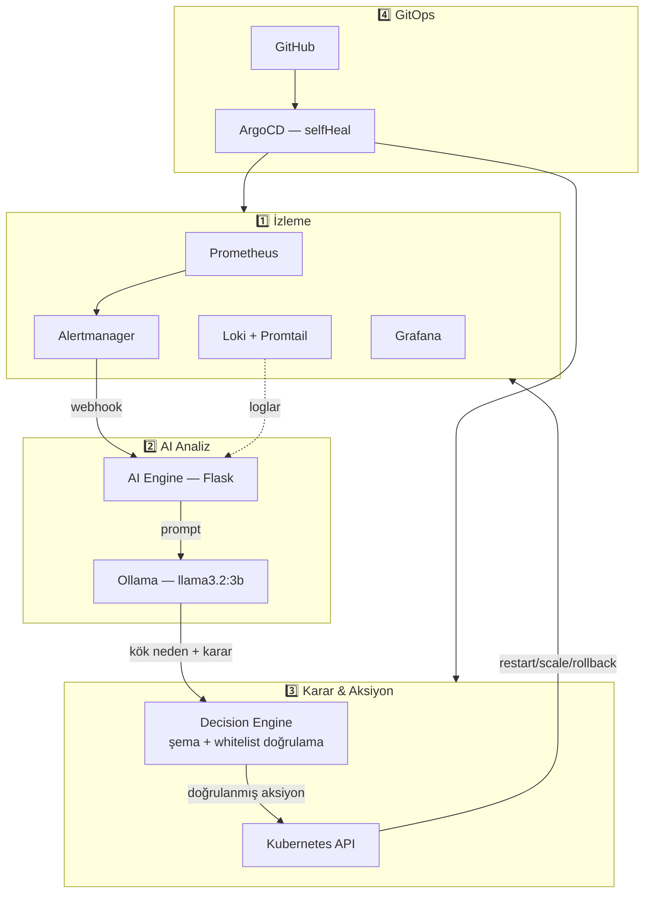

# 🤖 AI-Powered Self-Healing Kubernetes

**Bir Kubernetes cluster'ını, kendi hatalarını okuyup düzeltebilen bir
sisteme dönüştürme denemesi.**

---

## Bu proje ne, neden yaptım

DevOps dünyasında klasik akış hep aynıdır: bir şey bozulur, Prometheus
bunu fark eder, Alertmanager birine (Slack, e-posta, PagerDuty) haber
verir, o kişi logları okur, sebebi bulur, `kubectl` ile müdahale eder.
Bu zincirdeki en yavaş ve en pahalı halka **insan** — özellikle gece
yarısı, özellikle sorun aslında basitse (bir pod'u restart etmek,
bozuk bir deploy'u geri almak gibi).

Bu projede o zinciri kısaltmaya çalıştım: "insan" halkasının yerine,
loglara bakıp karar verebilen ve o kararı gerçekten uygulayabilen bir
LLM koydum. Ama bunu "AI'a sınırsız yetki ver, ne yaparsa yapsın" diye
değil, her adımda bir doğrulama/güvenlik katmanı olacak şekilde inşa
etmeye çalıştım — çünkü bir AI'ın production cluster'ında `kubectl`
çalıştırabilmesi, iyi tasarlanmazsa gerçekten tehlikeli bir fikir.

Aşağıdaki her şey, kendi laptopumda (Kind ile yerel bir cluster'da,
Ollama ile tamamen yerel bir LLM kullanarak) uçtan uca çalışır durumda.
Bulut API'sine, kredi kartına ihtiyaç yok.

## Nasıl çalışıyor (adım adım)



**1. Prometheus, cluster'ı her 15-30 saniyede bir "yokluyor".** CPU,
bellek, pod durumları gibi sayısal veriler burada toplanıyor. Bir
`PrometheusRule` (kendi yazdığım `alert-rules.yaml`) sürekli şu soruyu
soruyor: *"herhangi bir pod CrashLoopBackOff durumunda mı?"* Cevap evetse,
Alertmanager'a bir alarm düşüyor.

**2. Alertmanager, bu alarmı bana değil, doğrudan AI Engine'e (Flask
servisi) webhook olarak gönderiyor.** Burada ilginç bir teknik detay var:
alarmın hangi pod'a ait olduğunu biliyoruz ama hangi *deployment*'a ait
olduğunu bilmiyoruz — çünkü pod adları rastgele son ekler taşıyor
(`crashloop-demo-6bdb9d8787-ggdrw` gibi). Bunu, Prometheus sorgusunda
`label_replace()` fonksiyonuyla pod adından deployment adını "kazıyarak"
çözdüm.

**3. AI Engine, Loki'den o pod'un son loglarını çekiyor**, alarmın
etiketleriyle birleştirip Ollama'ya tek bir prompt'ta gönderiyor:
*"bu logda ne oldu, kök neden ne, ne yapmalıyım?"* Modelin cevabı
**serbest metin değil, katı bir JSON şemasına** zorlanıyor
(`{"action": ..., "target": ..., "confidence": ..., ...}`) — aksi
halde bir LLM'in ürettiği rastgele bir cümleyi `kubectl` komutuna
çevirmeye çalışmak felaket olurdu.

**4. Decision Engine, bu JSON'u kör güvenmiyor.** Üç kontrolden geçiriyor:
   - Aksiyon, önceden tanımlı 4 seçenekten biri mi (`restart_pod`,
     `scale_deployment`, `rollback_deployment`, `no_action`)?
   - Hedef namespace, izin verilen namespace ile eşleşiyor mu?
   - `rollback_deployment` seçildiyse, **gerçekten** geri dönülecek
     sağlıklı bir revizyon var mı (yoksa LLM'in "iyi niyetli ama
     imkansız" bir öneri sunmasını engelliyoruz)?

   Herhangi biri başarısız olursa, sistem güvenli varsayılana
   (`no_action`) düşüyor — "emin değilsem hiçbir şey yapma" ilkesi.

**5. Onaylanan aksiyon, Kubernetes Python client ile gerçekten uygulanıyor.**
AI Engine'in bunu yapabilmesi için bir `ServiceAccount` + `RBAC Role`'ü var,
ama bu yetki **kasıtlı olarak SADECE `test-app` namespace'inde** geçerli —
`monitoring` ya da `kube-system` gibi kritik namespace'lere asla dokunamaz.

**6. Tüm bu Kubernetes kaynakları (RBAC, deployment'lar, alert kuralları,
dashboard'lar) GitHub'da tutuluyor, ArgoCD bunları izliyor.** Cluster'da
elle bir şey değiştirilirse (ya da silinirse), ArgoCD'nin `selfHeal`
özelliği bunu birkaç dakika içinde Git'teki hale geri döndürüyor —
yani sistem sadece pod'ları değil, **kendi konfigürasyonunu da**
kendi kendine onarıyor.

## Kurulum

```bash
# 1) Cluster + izleme
bash kind/create-cluster.sh
kubectl apply -f kubernetes/namespace.yaml
bash monitoring/prometheus/install.sh
bash monitoring/loki/install.sh
bash monitoring/grafana/install-dashboard.sh

# 2) AI motoru
bash scripts/build-and-load-ai-engine.sh
bash kubernetes/self-healing/install.sh
bash scripts/pull-ollama-model.sh

# 3) Self-healing'i tetikle
kubectl apply -f monitoring/prometheus/alert-rules.yaml
bash scripts/generate-test-alert.sh
kubectl get pods -n test-app -w              # ayri terminalde izle
kubectl logs -n ai-engine -l app=ai-engine -f # ayri terminalde izle

# 4) GitOps (opsiyonel)
bash gitops/argocd/install-argocd.sh
# gitops/argocd/application.yaml icindeki repoURL'i kendi repo'nla degistir
bash gitops/argocd/apply-application.sh
```

Grafana: `http://localhost:3000` (admin/admin123) · Prometheus: `http://localhost:9090`

## Teknoloji Yığını

| Katman | Teknoloji | Neden bunu seçtim |
|---|---|---|
| Cluster | Kind | Saniyeler içinde kur/sil, gerçek çok-node'lu davranış |
| Metrikler | Prometheus + kube-state-metrics | Kubernetes state'ini sayısal metriğe çeviren fiili standart |
| Loglar | Loki + Promtail | Prometheus'un log karşılığı, aynı etiketleme mantığı |
| LLM | Ollama (llama3.2:3b, CPU) | Bulut API'sine bağımlı olmadan tamamen yerel çalışması için |
| AI servisi | Python + Flask | Basit, hızlı geliştirme, kubernetes-python-client ile doğal entegrasyon |
| GitOps | ArgoCD | Cluster durumunun tek doğruluk kaynağının Git olmasını garanti eder |

## Karşılaştığım gerçek sorunlar (ve nasıl çözdüm)

Bu bölümü özellikle bırakıyorum çünkü bir projenin "çalışıyor" demesiyle
"neden çalıştığını anlıyorum" demesi arasındaki fark burada saklı.

**"AI hiçbir şey yapmadı, no_action dedi" — ama bu bir hataydı, o da haklıydı.**
İlk test senaryomda pod'u kasten sürekli çökecek şekilde yazmıştım.
LLM alarmı görüp "restart etsem de fayda etmez, zaten sürekli çöküyor"
diye (doğru bir şekilde) `no_action` dedi. Sorun senaryomdaydı, AI'da değil.

**Kubernetes'in kendi otomatik iyileşmesi, benim test senaryomu "yendi".**
Bir container çöktüğünde kubelet, pod'u silmeden container'ı otomatik
olarak yeniden başlatıyor — saniyeler içinde. Ben "restart ile düzelen
geçici bir hata" simüle etmeye çalıştığımda, Prometheus'un alarm
üretmesi için gereken ~30-60 saniye geçene kadar kubelet zaten sorunu
kendi başına çözmüş oluyordu. AI'ın müdahalesi gereksiz kalıyordu çünkü
gerçekten gerekli değildi. Bu beni daha gerçekçi bir senaryoya
yönlendirdi: **"kötü bir deploy" simülasyonu** — önce sağlıklı bir
versiyon çalıştırıp, sonra kasıtlı olarak bozuk bir versiyon deploy
ediyorum. Bu, kubelet'in restart'la çözemeyeceği (çünkü sorun kod/config
seviyesinde), ama AI'ın rollback ile çözebileceği gerçek bir durum.

**LLM, JSON şemasına her zaman tam uymuyordu.** `target` alanına bazen
`"crashloop-demo"` yerine `{"kind": "Deployment", "name": "crashloop-demo"}`
gibi bir nesne yazıyordu. Hem prompt'u netleştirdim ("düz metin yaz, nesne
YAZMA") hem de kod tarafında bir savunma ekledim (nesne gelirse otomatik
`name` alanını çıkar). İkisi birden gerekliydi — sadece prompt'a güvenmek
riskli, sadece koda güvenmek de LLM'i "eğitmemek" demek.

**İki farklı alarm kuralı, aynı pod için yarışan kararlar üretti.**
Kubernetes'in kendi varsayılan `KubePodCrashLooping` kuralı ile benim
yazdığım `PodCrashLooping` kuralı, aynı olayı FARKLI isimlerle
tetikliyordu. İlk tekrar-engelleme (dedup) mekanizmam alarm *adına* göre
çalıştığı için bu ikisi birbirini görmüyordu — sonuç: biri rollback
yaparken diğeri (biraz farklı zamanlama ve stale veriyle) üzerine
farklı bir aksiyon uygulayabiliyordu, klasik bir *race condition*.
Çözüm iki parçalıydı: dedup anahtarını alarm adı yerine **hedef
deployment**'a göre değiştirdim, ve aynı hedef için gerçek bir mutex
(kilit) ekleyerek eş zamanlı işlemleri tamamen engelledim.

## Güvenlik Yaklaşımı

AI'a cluster üzerinde komut çalıştırma yetkisi vermek başlı başına riskli
bir karar. Bunu tek bir kontrol noktasına değil, üst üste binen birkaç
katmana yaydım — biri atlanırsa diğeri yakalasın diye:

1. **RBAC** — AI Engine sadece `test-app` namespace'inde, sadece pods/
   deployments üzerinde, sadece belirli fiillerde (get/list/delete/patch)
   yetkili.
2. **Whitelist** — LLM'in önerebileceği aksiyonlar 4 seçenekle sınırlı.
3. **Şema doğrulama** — Parse edilemeyen ya da eksik alan içeren her
   cevap güvenli varsayılana düşer.
4. **Mantıksal doğrulama** — Örn. rollback önerilse bile gerçekten
   geri dönülecek bir revizyon yoksa aksiyon iptal edilir.
5. **Namespace çift kontrolü** — Hem RBAC hem uygulama kodu, aksiyonun
   sadece izinli namespace'de kalmasını ayrı ayrı garanti eder.

## Bilinen Sınırlamalar

- `restart_pod`, Kubernetes'in kendi container-level otomatik retry'ıyla
  büyük ölçüde örtüşüyor; asıl değeri pod'un tamamen yeniden yaratılması
  gereken (state/identity sıfırlama) durumlarda ortaya çıkıyor.
- 3B parametrelik yerel model bazen karmaşık muhakemede tutarsız kalabiliyor;
  production'da daha büyük bir model (Mistral 7B) ya da bulut LLM'i
  daha güvenilir olurdu, bedeli daha yüksek gecikme/maliyet.
- Ollama tek replika; yoğun trafikte kuyruklanma riski var.

## Proje Yapısı

```
ai-self-healing-k8s/
├── kind/                  # Cluster tanımı
├── kubernetes/            # Namespace + self-healing RBAC/deployment'lar
├── monitoring/            # Prometheus, Loki, Grafana kurulumları
├── ai-engine/             # AI mikroservisi (Flask + LLM entegrasyonu)
│   ├── routes/webhook.py         # Alertmanager giris noktasi
│   ├── services/                  # Loki, Ollama, Kubernetes API entegrasyonlari
│   ├── analyzers/decision_engine.py  # Dogrulama + whitelist katmani
│   └── prompts/                   # Versiyon kontrollu LLM promptlari
├── gitops/                # ArgoCD kurulumu ve GitOps manifestleri
├── test-scenarios/        # Kasıtlı hata senaryoları
└── scripts/               # Yardımcı otomasyon script'leri
```

## Lisans

MIT
